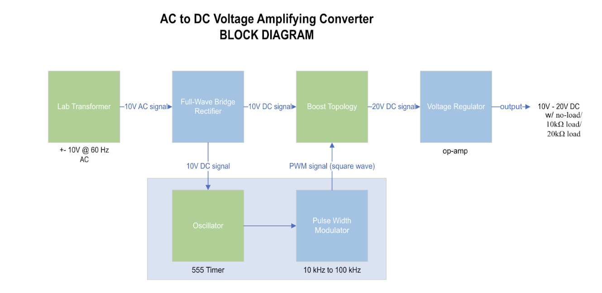
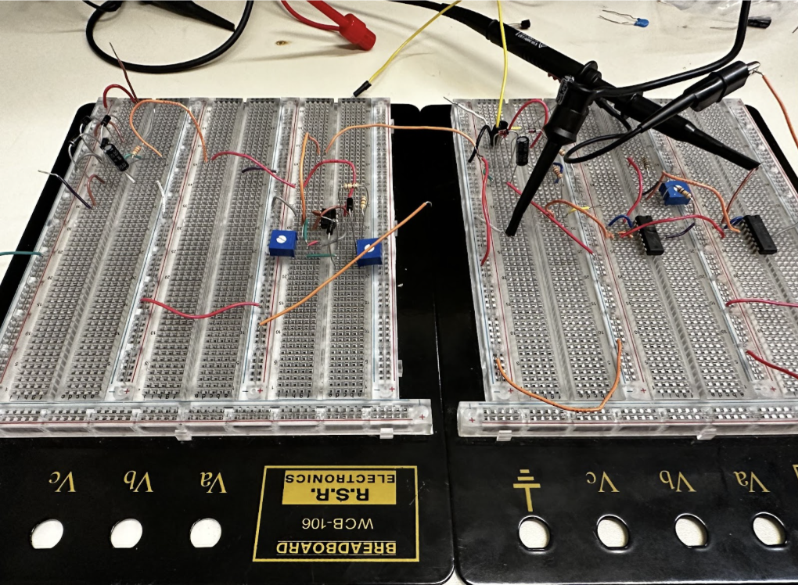

## Description:

For our EE 331 course, we had to build an AC-DC voltage amplifying converter that uses a rectifier, a boost topology, and a voltage regulator.

The functions of each component were as follows:
- Rectifier: Transforms 10V AC input signal to 10V DC signal with <1.0V ripple voltage.
- Boost Topology: Uses duty-cycle input voltage from PWM to boost 10V DC input voltage up to 20V.
- Voltage Regulator: Regulates output voltage to be between 10-20V while providing 0-1mA of current to load.

We first drew up a block diagram of the specifications for our project components. We then created and tested our circuit schematic on LTspice simulation software. We finally moved on to implementing our circuit on breadboard.

Disclaimer: We could not get all components to work together consistently as intended. However, each component functioned as expected independently.

### Here is our block diagram of our specific components:

### Here is our final circuit:

Full-Wave Bridge Rectifier, PWM, Boost Converter, Voltage Regulator, Load (left to right)

Note: Not sure if sharing these pictures supports plagiarism but if you can get your circuit working by using the information I've shared here, you deserve the grade.

## Acknowledgments:
- I want to thank my group members-- Genie, Ewan, and Jarod -- for their tremendous support and dedication on this project We worked together on the circuit several days from mornings to evenings.
- I want to thank TA Alana Dee for being patient and guiding us in our project.
- I also want to thank Professor Tai Chen for listening to our problems and offering his support.