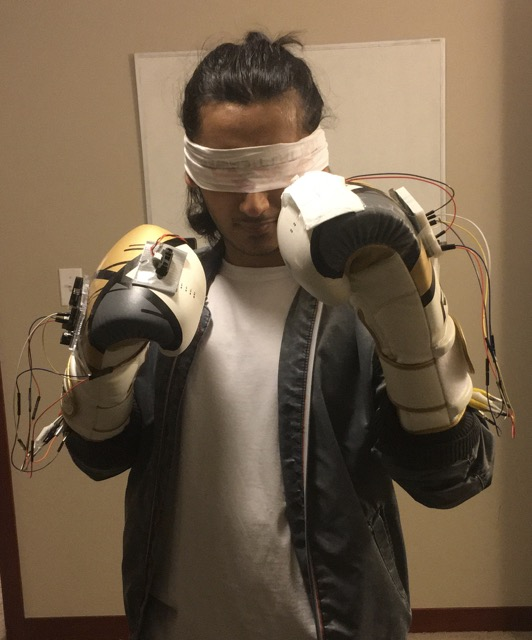

## Description:

As a fan of the Netflix show 'Daredevil', I wanted to use Arduino and PureData to implement a set of boxing gloves that would help a blind person effectively be a boxer.

### Materials:

- Arduino board
- IR Proximity sensor
- Force/Pressure sensor
- Arduino C/C++
- PureData
- Plenty of wires

### Instructions:

- Attached a proximity sensor and a force sensor to 2 boxing gloves
- Configured a script into my Arduino board with functions for each glove:
   - Play a sine wave with frequency dependent on proximity sensor readings
   - Play a "boing!" sound effect when the force sensor receives sufficient force
- Used laptop to run script while sensors were taking readings to run each function
- Used plenty of wires connecting all components and wore laptop in a backpack to keep connections.

### Costume photos:

