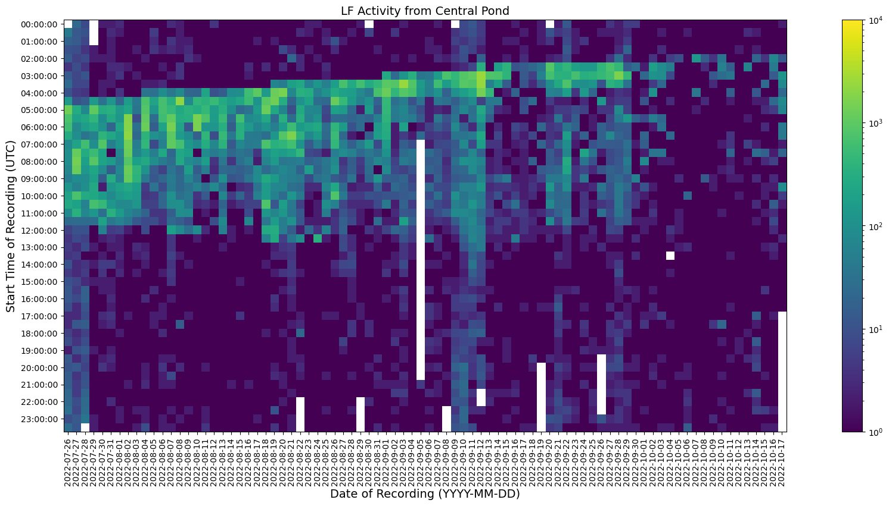
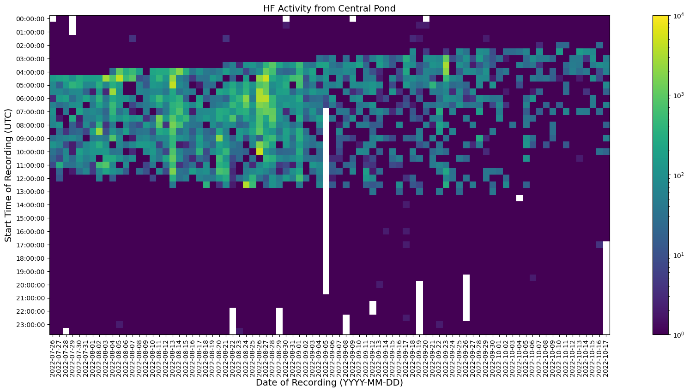

## Description:

I worked under my principal investigator, Dr. Wu-Jung Lee, to conduct a passive acoustic bat monitoring project. My colleague, Josie Sachen, and I deployed 6 Audiomoth recorders at 6 different locations at the Union Bay Natural Area near the UW's football stadium and the E-18 parking lot.

Our intention was to collect acoustic activity of echolocating bats over the Summer season when bat activity rises with the increase of insect presence. We could use this activity to develop computational bat call detectors and understand how to build a long-term PAM project for studying the use of echolocation in navigation and foraging in bats.

We collected acoustic activity from June to October 2022 with certain Audiomoth configurations:
- Sampling rate: 192000 Hz 
- Recording schedule: 00:00 to 24:00 UTC
- Record/Sleep Cycle: 1795 seconds on / 5 seconds off

## Slides created during project:

- [Details focusing on project materials, methods, and locations](./20220830_summer.pdf)
- [Details focusing on project results, conclusions, and future steps](./20221109_recap.pdf)

### Here is the [Github repo](https://github.com/uw-echospace/union-bay-bats) for this project.

## Activity plots for all 6 locations

Notes:
- We used RavenPro's Band-Limited Energy Detector to produce bat call detections. 
   - This detector looks at signal energy and is non-specific -- not paying attention to the shape or pattern of calls. 
   - This meant that our detections would not be high in accuracy but the detector worked fast and provided time durations and frequency ranges for each call.
- Here we also divided bat calls into two observed major groupings: low-frequency bat calls (20-45kHz) and high-frequency bat calls (35-75kHz), denoted as LF and HF respectively.

### Central Pond

Low-frequency bat call activity from July 29th to October 17th

High-frequency bat call activity from July 29th to October 17th

## Acknowledgements for this project:

- I want to thank my colleague Josie Sachen for helping us with this project. 
   - We had to work 2-3 times a week for 4 hours, sometimes during Seattle heat waves and I'm thankful for her support.
   - The UBNA Bat Monitoring Logo (featured image) was also inspired from our shared interest in the Jurassic Park movies.
- I also want to thank the Applied Physics Laboratories for the funding they provided me towards this project.
- I finally want to acknowledge my principal investigator Wu-Jung Lee for her patience and guidance in performing fieldwork and developing analytical methods for collected acoustic data.
   - With her guidance, I have been honored to receive the Mary Gates Research Scholarship and present at the UW's 25th and 26th Undergraduate Research Symposium.
